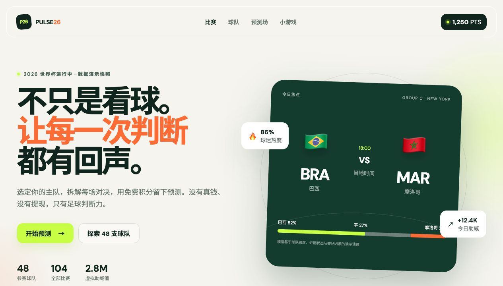

# taofeng_vibe_coding

> A little workshop where I build things with AI coding agents — and learn by shipping, not by reading about shipping.

For most of my career as a product manager, my job was to *describe* what should get built and hand it to people who could actually build it. Lately I've been doing the opposite: sitting down with an AI agent and making the whole thing myself — design, code, pixel art, sound, the embarrassing bugs, all of it.

This repo is where those experiments live. I call it "vibe coding" on purpose. I usually don't know exactly how something should work when I start — I describe a feeling, an idea, a joke — and then iterate with the agent until it's real and fun. The goal isn't elegant architecture. The goal is to learn, hands-on, what it really takes to go from *idea → a thing you can play* — and to keep the ones worth keeping.

> 一个用 AI 一起做小东西的地方。先动手、再补理论；先做出来、好玩的留下。

---

## Projects

### ⚽ WorldCupSimulation: Pulse26

**▶ [Open the interactive World Cup experience →](https://taofeng-sketch.github.io/taofeng_vibe_coding/WorldCupSimulation/)**

A mobile-first 2026 World Cup fan experience: explore all 48 teams, follow the match center, compare explainable win probabilities, make free points-based predictions, support a team, leave a cheer, and take a five-round penalty challenge.

- **Interactive, not just informative.** Predictions, fan support, cheers, and a quick skill game turn every visit into something you can do.
- **Transparent by design.** Probability factors are visible, points have no monetary value, and demo data is clearly labelled.
- **Portable and tested.** Vanilla HTML/CSS/JS, zero build step, local progress through `localStorage`, plus automated model QA.

Code and project documentation are in **[`WorldCupSimulation/`](./WorldCupSimulation)**.

---

### 🦑 Squid Technologies: Performance Review Climb

**▶ [Play it in your browser →](https://taofeng-sketch.github.io/taofeng_vibe_coding/squid-climb/)**

A satirical big-tech roguelike **deckbuilder** — think *Slay the Spire*, but the final boss is your year-end review.

You're a fresh graduate climbing the ladder at the fictional **Squid Technologies** ("Move Tentacles Fast™"). Spend your **Working Hours** to play cards, keep your **Pulse** above zero, climb from IC3 toward VP — and try to survive the **Calibration Council** without getting *managed out*. The enemies are bugs, legacy systems, and the PM who keeps saying "let's align."

- Built with **Phaser 3** + vanilla JS, **zero build step** — runs offline from a single folder.
- AI-generated pixel art; chiptune music + SFX **synthesized live** in the browser (no audio files).
- A different track for every scene, per-card art, attack/hurt animations, and a hover ring so you can see exactly which card you're about to play.

Code, design notes, and the honest "why I built this" are in **[`squid-climb/`](./squid-climb)**.

*It's affectionate satire. The company is fictional; any resemblance to your last performance cycle is coincidental.*

---

## How I work here

- **One idea at a time.** Get it playable, then decide if it's worth going deeper.
- **Test it like a user.** Every project here gets actually run — clicked, played, broken on purpose — before I call it done.
- **Keep it boringly portable.** No bundlers, no servers; double-click an `index.html` and it works offline.
- **Stay honest in the README.** What works, what's faked, what I'd do differently — written down, not hidden.

More small things will land here over time. If you play something and it breaks (or makes you laugh), that's useful — open an issue.
