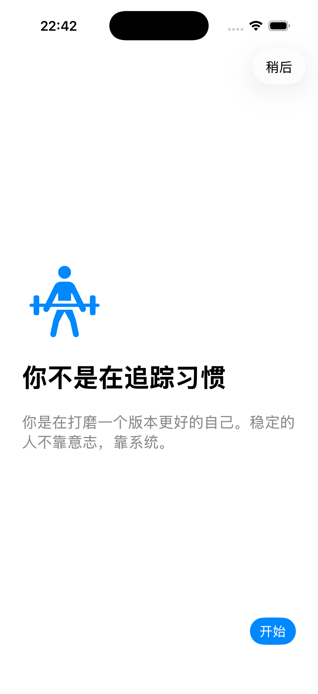
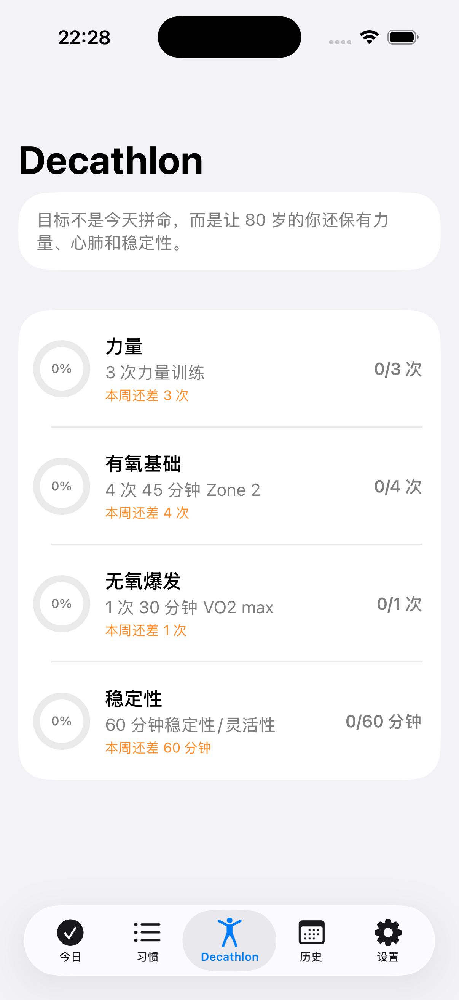
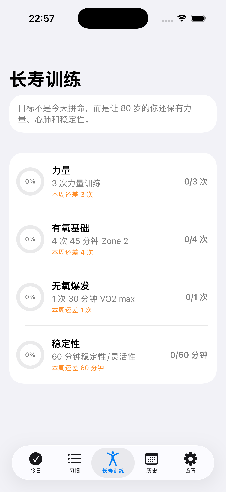

# HabitApp iOS

> A native iOS habit and longevity coach built with SwiftUI, SwiftData, HealthKit, StoreKit 2, and AI-assisted product iteration.

HabitApp started as a simple habit tracker and grew into a more opinionated system: track small daily actions, understand recovery and protein intake, use identity-based coaching, and make the app useful from day one with habit packs and widgets.

The positioning is deliberately narrow: **a longevity habit OS for men 35+**. It is not trying to beat nutrition apps on food-database accuracy. It focuses on decision quality, behavior change, and daily retention.

## Screenshots

<p>
  
  
  
  
</p>

## What It Does

- **Habit system**: create, edit, enable, and check in habits with local notifications.
- **Tiny Habits anchors**: each habit can include an anchor such as "after brushing teeth".
- **Breakfast photo analysis**: camera capture sends a compressed JPEG to Claude using the user's own Anthropic API key.
- **Meal logging**: parsed calories and macros are stored in SwiftData and can be written back to Apple Health.
- **Protein-first coaching**: daily protein target is based on body mass x 1.6g/kg.
- **AI morning brief**: once-per-day coaching copy using sleep, HRV, habits, protein, identity tags, and coach memory.
- **Centenarian Decathlon tab**: HealthKit workout progress across strength, Zone 2, VO2, and stability pillars.
- **Recovery ritual**: low-HRV days can trigger a guided Box or 4-7-8 breathing session.
- **Weekly review**: Sunday afternoon reflection with habit, protein, recovery, and training context.
- **First-run onboarding**: identity tags, body mass, permissions, and habit-pack selection.
- **Habit packs**: free and Pro habit templates for faster setup.
- **StoreKit 2 shell**: Pro entitlement, paywall, restore purchases, and feature gating.
- **AI coach memory**: editable goals, constraints, preferred coaching style, and advice to avoid.
- **WidgetKit source**: Home Screen and Lock Screen widgets for habit progress, protein, and daily brief.

## Tech Stack

- SwiftUI
- SwiftData + CloudKit-ready models
- HealthKit read/write
- StoreKit 2
- WidgetKit source files
- UserNotifications
- Keychain Services
- Anthropic Messages API

## Project Structure

```text
habitapp-ios/
├── HabitApp.xcodeproj/
├── HabitApp/
│   ├── Models/
│   ├── Services/
│   ├── Views/
│   ├── HabitAppApp.swift
│   ├── Info.plist
│   └── HabitApp.entitlements
├── HabitAppWidgets/
│   ├── HabitAppWidgetsBundle.swift
│   ├── TodayCheckinWidget.swift
│   ├── ProteinRingWidget.swift
│   ├── DailyBriefWidget.swift
│   ├── LockScreenWidget.swift
│   └── HabitAppWidgets.entitlements
└── assets/screenshots/
```

## Run Locally

Requirements:

- Xcode 16 or newer
- iOS Simulator or a signed physical iPhone
- Optional: Anthropic API key for breakfast photo analysis and AI text coaching

Build from the command line:

```bash
cd habitapp-ios
xcodebuild \
  -project HabitApp.xcodeproj \
  -scheme HabitApp \
  -destination 'platform=iOS Simulator,name=iPhone 17,OS=26.5' \
  build
```

Open in Xcode:

```bash
open HabitApp.xcodeproj
```

If Xcode shows "A build only device cannot be used to run this target", select a concrete simulator such as `iPhone 17` or connect a real iPhone. Do not run against `Any iOS Device`.

## Signing And Capabilities

The app target uses:

- iCloud / CloudKit
- HealthKit
- App Groups: `group.com.taofeng.habitapp`

On a new machine, open the target's **Signing & Capabilities** tab and make sure those capabilities match your Apple developer account.

## Anthropic API Key

The app stores the Anthropic key in the local iOS Keychain with `ThisDeviceOnly` accessibility.

The key is used for:

- breakfast photo analysis
- Pro AI morning brief
- Pro weekly review

The key is not stored in UserDefaults, not written to SwiftData, and not synced through iCloud.

## Pro Gating

Free:

- habits
- check-ins
- history
- breakfast photo analysis using the user's own API key
- Today summary
- protein ring
- HealthKit nutrition write

Pro-gated:

- AI daily brief Claude call
- weekly review Claude call
- Centenarian Decathlon tab
- recovery breathwork entry
- Pro habit packs

## WidgetKit Status

Widget source files are generated under `HabitAppWidgets/`, but the full Widget Extension target is intentionally not hand-edited into the project file yet.

To enable widgets:

1. Open `HabitApp.xcodeproj`.
2. Choose **File -> New -> Target -> Widget Extension**.
3. Name it `HabitAppWidgets`.
4. Add the files from `HabitAppWidgets/` to the widget target.
5. Add shared model files to the widget target membership: `Habit.swift`, `CheckIn.swift`, `MealEntry.swift`, `DailyBrief.swift`, and `WeeklyReview.swift`.
6. Enable App Groups for both app and widget targets with `group.com.taofeng.habitapp`.
7. Set the widget target entitlements file to `HabitAppWidgets/HabitAppWidgets.entitlements`.

The widget code reads SwiftData through:

```swift
ModelConfiguration(
    schema: schema,
    isStoredInMemoryOnly: false,
    groupContainer: .identifier("group.com.taofeng.habitapp"),
    cloudKitDatabase: .automatic
)
```

## Validation

Last verified locally with:

```bash
plutil -lint HabitApp.xcodeproj/project.pbxproj HabitApp/Info.plist HabitApp/HabitApp.entitlements HabitAppWidgets/HabitAppWidgets.entitlements
xcodebuild -project HabitApp.xcodeproj -scheme HabitApp -destination 'platform=iOS Simulator,name=iPhone 17,OS=26.5' build -quiet
xcrun simctl install C86DF52D-CD44-4FE1-9BD7-29123D9B5A90 <DerivedData>/HabitApp.app
xcrun simctl launch C86DF52D-CD44-4FE1-9BD7-29123D9B5A90 com.taofeng.habitapp
```

Result: build, install, and launch passed on `iPhone 17 / iOS 26.5`.

## Notes

This is a prototype-quality native app, not an App Store release. The main app runs in simulator. Widget target registration, StoreKit product setup, production CloudKit schema deployment, and real-device HealthKit testing are the next hardening steps.
